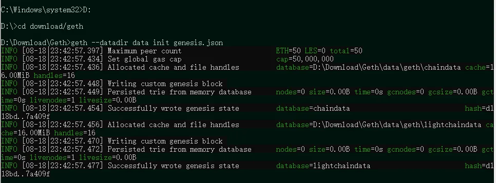
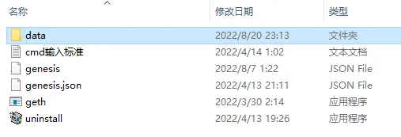
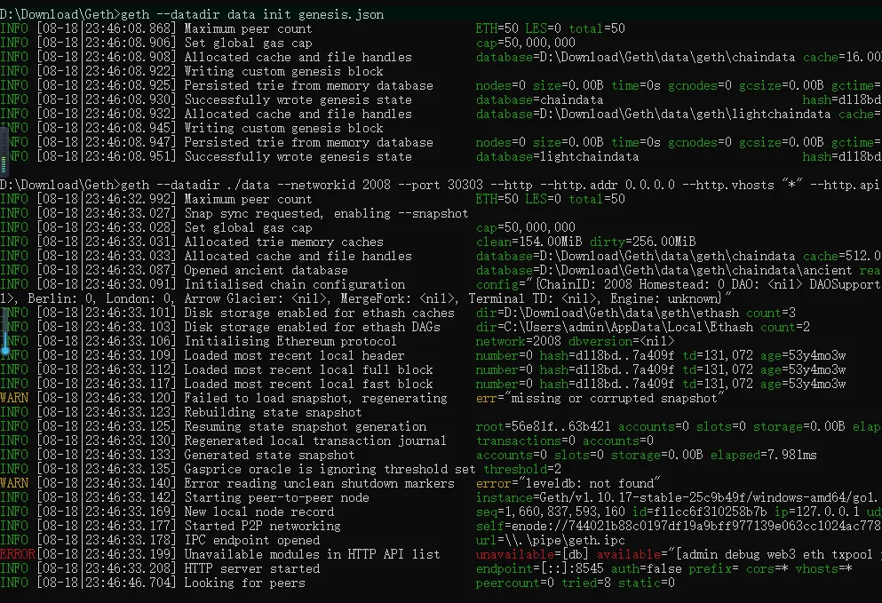
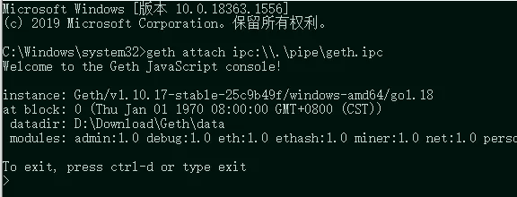
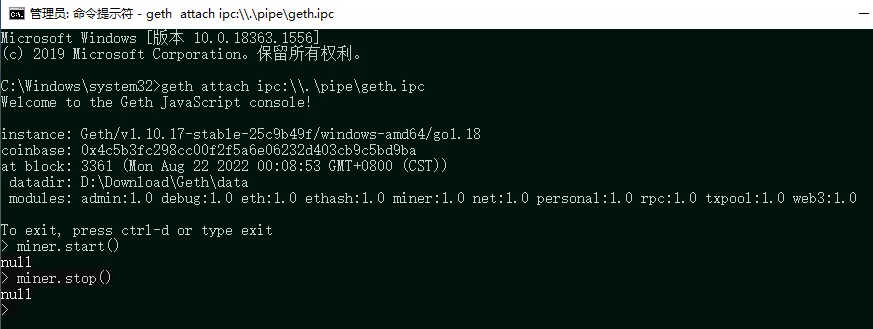
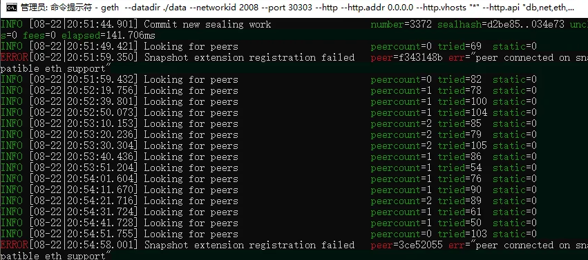

一：准备 genesis.json 文件

文件内容如下：

```
{
    "config": {
        "chainId": 2008,
        "homesteadBlock": 0,
        "eip150Block": 0,
        "eip155Block": 0,
        "eip158Block": 0,
        "byzantiumBlock": 0,
        "constantinopleBlock": 0,
        "petersburgBlock": 0,
        "istanbulBlock": 0,
        "berlinBlock": 0,
        "londonBlock": 0
    },
    "alloc": {},
    "coinbase": "0x0000000000000000000000000000000000000000",
    "difficulty": "0x20000",
    "extraData": "",
    "gasLimit": "0x2fefd8",
    "nonce": "0x0000000000000042",
    "mixhash": "0x0000000000000000000000000000000000000000000000000000000000000000",
    "parentHash": "0x0000000000000000000000000000000000000000000000000000000000000000",
    "timestamp": "0x00"
}
```

二：命令行启动（标准模式）

2.1 打开 cmd（管理员模式），进入到 geth 所在的文件夹

2.2 执行命令 ```geth --datadir data init genesis.json```



————此页面代表执行成功

注意：此时，geth 文件夹中出现了 data 文件夹：



2.3 执行命令

```geth --datadir ./data --networkid 2008 --port 30303 --http --http.addr 0.0.0.0 --http.vhosts "_" --http.api "db,net,eth,web3,personal" --http.corsdomain "_" --snapshot=false --allow-insecure-unlock```

四个要注意的细节：

● "--datadir ./data"，与 2.2 命令结合起来看，代表要将区块的数据放入哪个文件夹，因此两处命令的文件夹名称必须一致

● networkid 一定要和 genesis.json 中的 chainId 参数一致

● 与 http 相关的所有参数可以不写，如果不写，将无法和 MetaMask 等钱包进行交互（之前的版本使用的是 rpc，后来改成了 http）

● --allow-insecure--unlock 参数可以不写，如果不写，意味着每次转账都需要先解锁账户，这个后面会再次提到



————此页面代表执行成功

2.4  
新打开一个 cmd（管理员模式），无需进入 geth 所在文件夹，直接执行命令：```geth attach ipc:\\.\pipe\geth.ipc```

特别注意：之前的那个 cmd 不能关闭

————此页面代表执行成功



至此，标准模式下的 Geth 已启动，私链已初始化完成

一些补充：

1. Geth 关闭后，如何重启

经常有朋友把 geth 关了后，就不知道怎么重启了，这里统一做个说明

● 如下有两个界面：

上面这个界面称为 A，下面称为 B





——如果仅关闭 A：

重启方案：以管理员模式打开 cmd，无需进入到 geth 文件夹，直接输入 ```geth attach ipc:\\.\pipe\geth.ipc```

——如果 A 与 B 都关了：

重启方案：以管理员模式打开 cmd，进入 geth 文件夹，再输入：```geth --datadir ./data --networkid 2008 --port 30303 --http --http.addr 0.0.0.0 --http.vhosts "_" --http.api "db,net,eth,web3,personal" --http.corsdomain "_" --snapshot=false --allow-insecure-unlock```

然后，用管理员模式打开一个新的 cmd，无需进入 geth 文件夹，直接输入 ```geth attach ipc:\\.\pipe\geth.ipc```

——如果仅关闭 B：此情况不存在，因为把 B 关了 A 就不运行了，等于 A 也同时被关了
