一：账户相关

我们先执行账户查询的操作：`eth.accounts`

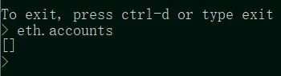

发现什么也没有，是因为我们还没有在自己的私链上创建或导入以太坊地址

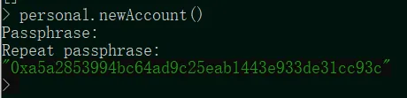

好的，我们现在来创建一个，执行命令：`personal.newAccount()`，然后输入密码，确认密码，即可生成新的以太坊地址

再次执行`eth.accounts`，发现已经有了一个地址

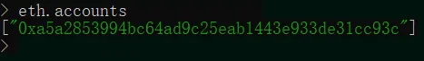

新生成的地址肯定是没有钱的，通过以下两行命令都可以获取到该账户的余额

`eth.getBalance("以太坊地址")`

`eth.getBalance(eth.accounts[0])`，刚刚生成的地址保存在 eth.accounts 数组中

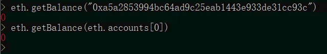

——对于私链中第一个地址，默认为 eth.coinbase，因此还有另外一种获取余额的方式：

`eth.getBalance(eth.coinbase)`

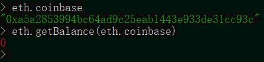

二：挖矿相关

账户里没有钱（以太坊）怎么办，两个方法：一个让其他地址转钱，另一个方法是挖矿

当然，由于这条区块链是新搭建的，链上还没有生成任何的币（其他以太坊地址的币与此链并不相通，因为链 ID 不同），因此我们先来尝试挖矿的方法：

执行命令`miner.start()`，这里返回"null"是正常现象

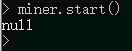

然后在另一个 cmd 中，发现正在疯狂地更新数据：

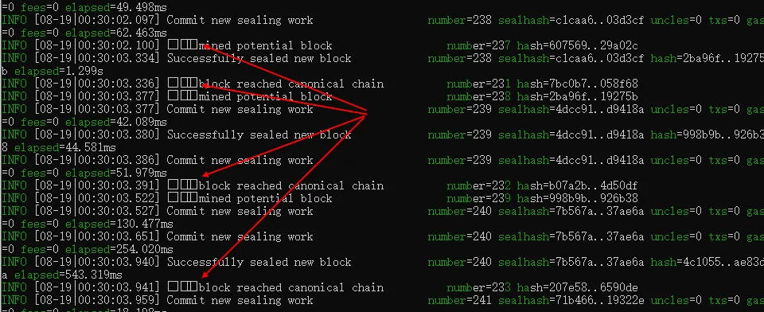

出现红色箭头所指的特殊符号，代表挖矿成功（emmmm，发现挖矿如此快其实是之前在 genesis.json 文件中初始定义的挖矿难度太低导致的，如果想折磨自己的话，可以把难度值调大一点）

现在我们把挖矿关停，执行命令：`miner.stop()`，这里返回"null"也是正常现象

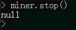

———其实还可以多线程挖矿：`miner.start(5)`，这里同时开五个线程，然后发现其实可能没什么茑用，除非你的电脑是四核/八核及以上 CPU

挖了这么多区块，可以用 `eth.blockNumber`来查询以下当前的区块高度

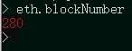

有了币，我们再来获取一下余额：

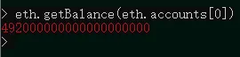

这余额数字那么大，根本数不过来，但其实这个余额是用"wei"单位来表示的（1 ETH = 1e18 Wei），因此要去掉 18 个 0

执行命令：`web3.fromWei(eth.getBalance(eth.accounts[0]),'ether')`，即可将余额用 ETH 单位来表示

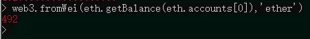

三：转账/交易相关

我们要在此链上发布一笔转账，这里就转钱给自己的 MetaMask 账户吧

——算了算了，这样太快了，还是先用本地存储的账户来先测试一下

新填一个账户：

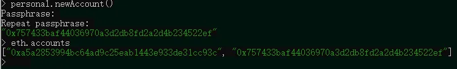

通过以下命令执行转账操作：三个参数 from,to,value

`eth.sendTransaction({from: eth.accounts[0],to:eth.accounts[1],value:web3.toWei(10,'ether')})`

然后尴尬地发现居然报错了：

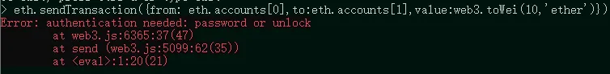

原因是 from 账户没有被解锁（unlock），为了保证转账的发起者不是别人而是自己，需要先对账户进行解锁（其实是身份核验）

执行如下命令，然后输入密码，即可解锁（返回 true）

`personal.unlockAccount(eth.accounts[0])`

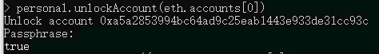

再次执行转账命令：

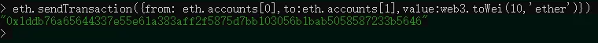

出现绿色的一串 16 进制数，代表成功，这一串数字是交易哈希

——如果没有出现，可以检查下是否余额足够

但是，这只是生成了交易，还没有将交易的数据上链

因此，挖矿吧：

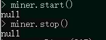

然后，就可以在刚刚挖到的第一个区块找到这笔交易了

我们通过：`eth.getBlock(区块号)`命令来获取某区块的所有数据，我这边是 265

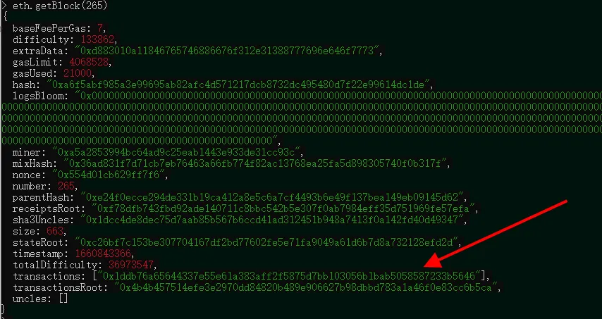

看到"transactions"这一行，发现里面存储了刚刚那笔交易的哈希

——如果 transactions 没有数据，原因就是交易不在该区块中，区块号没有找对

除此之外，还可以通过以下命令获取到交易的具体信息：

`eth.getTransaction("交易哈希")`

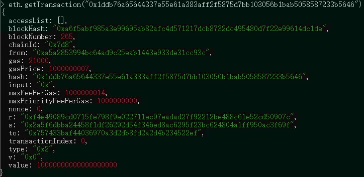

很好，现在你已经知道如何发起一笔转账并查询交易数据了，接下来再用 MetaMask 钱包来过一下瘾

四：与 MetaMask 交互

首先，你得有一个 MetaMask 的钱包，没有就先下载一个

先要导入本地的 "localhost" 网络：

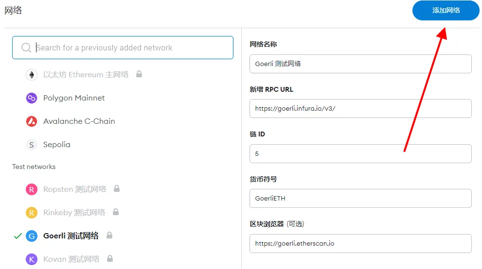

发现这儿没有，需要自己添加

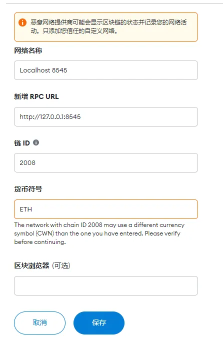

除了链 ID 写自己 genesis.json 里的 chainId 外，其他直接照填

————然后就可以发起转账了

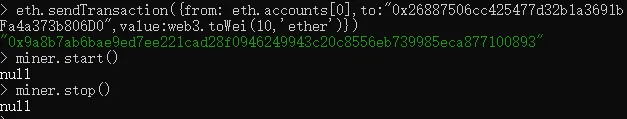

——可能出现了账户又被 unlock 了，这个时候需要再解锁一下 from 账户

交易完成后，发现 MetaMask 多了几个 ETH：

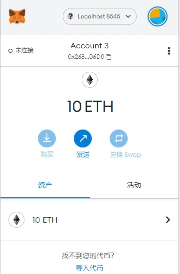

当然，这不是主网的 ETH 啦，是刚刚自己搭建的区块链上的 ETH

五：其他操作：

5.1 换一个人挖矿

刚刚上面的操作，挖矿只能是 eth.coinbase 这个账户在挖，现在我们打算换一个账户：

就换我们自己 MetaMask 的账户来挖吧：

首先执行如下操作：

`miner.setEtherbase("地址")`

返回 true 后再进行挖矿：

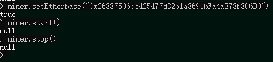

然后发现钱包多了好多 ETH，刚刚还是 10 个的

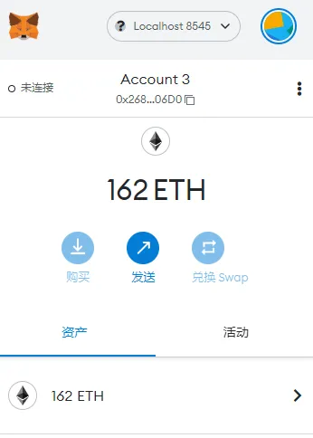

———以后的智能合约测试直接用本地自己搭建的链就行了，因为有用不完的 ETH
